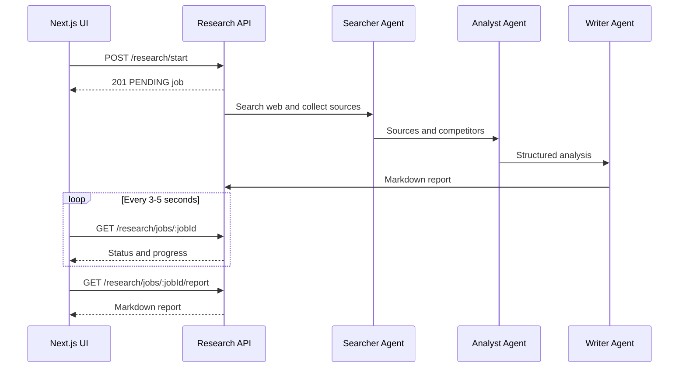

# Frontend Deep Research Integration Guide

This guide explains how to connect the Next.js frontend to the asynchronous deep-research workflow in the NestJS API.

The workflow is:



The start request returns immediately. Research continues in the backend and normally takes several minutes. The frontend must poll the job endpoint; it must not keep the original POST request open.

## 1. API configuration and authentication

Backend base URL during local development:

```env
NEXT_PUBLIC_API_URL=http://localhost:4000
```

Every research endpoint requires:

```http
Authorization: Bearer <access_token>
```

The existing `lib/api/client.ts` Axios interceptor already adds this header. The authenticated user must belong to an organization, because all jobs and sources are organization-scoped.

## 2. Start request

### Endpoint

```http
POST /research/start
Content-Type: application/json
Authorization: Bearer <access_token>
```

### Minimal payload

This remains valid. The backend creates a useful default question for the selected type.

```json
{
  "researchType": "COMPREHENSIVE"
}
```

### Recommended payload

```json
{
  "researchType": "COMPREHENSIVE",
  "query": "How is the digital wallet market in Nepal changing, and where are the strongest growth opportunities for our company?",
  "instructions": "Prioritize evidence from the last 12 months. Compare pricing, customer needs, regulation, and the five strongest competitors. End with an actionable 90-day plan.",
  "parameters": {
    "focusAreas": ["market size", "pricing", "customer pain points", "regulation"],
    "geography": "Nepal",
    "timeHorizon": "Last 12 months"
  }
}
```

### Research types

| Value | Use it for |
| --- | --- |
| `COMPETITOR` | Competitor identification, positioning, pricing, strengths, weaknesses, and gaps |
| `MARKET` | Market landscape, trends, risks, regulation, and growth opportunities |
| `CUSTOMER` | Customer segments, needs, pain points, buying behavior, and service opportunities |
| `COMPREHENSIVE` | Combined competitor, market, customer, gap, and strategic analysis |

`query` is optional, 3-2,000 characters. `instructions` is optional and limited to 4,000 characters. `parameters` is an optional JSON object for UI-specific structured filters.

### `201 Created` response

```json
{
  "id": "research-job-uuid",
  "organization_id": "organization-uuid",
  "status": "PENDING",
  "research_type": "COMPREHENSIVE",
  "input_parameters": {
    "initiatedBy": "user-uuid",
    "timestamp": "2026-08-14T05:30:00.000Z",
    "query": "How is the digital wallet market in Nepal changing?",
    "instructions": "Prioritize evidence from the last 12 months.",
    "parameters": {
      "focusAreas": ["pricing", "customer pain points"]
    }
  },
  "agent_orchestration_state": {},
  "created_at": "2026-08-14T05:30:00.000Z",
  "message": "Deep research started. This may take 5-10 minutes."
}
```

Save `id`, navigate to `/dashboard/research/{id}`, and begin polling.

## 3. Other API endpoints

### List the latest jobs

```http
GET /research/jobs
```

The endpoint currently returns the latest 10 organization jobs:

```json
{
  "jobs": [
    {
      "id": "research-job-uuid",
      "organization_id": "organization-uuid",
      "status": "IN_PROGRESS",
      "research_type": "MARKET",
      "input_parameters": {},
      "agent_orchestration_state": {},
      "output_results": null,
      "error_message": null,
      "created_at": "2026-08-14T05:30:00.000Z",
      "completed_at": null
    }
  ]
}
```

### Get one job and its progress

```http
GET /research/jobs/:jobId
```

Possible statuses:

- `PENDING`: accepted but the Searcher has not started.
- `IN_PROGRESS`: one of the agents is running.
- `COMPLETED`: the final Markdown report is available.
- `FAILED`: processing stopped; show `error_message` and allow the user to start a new job.

During processing, use `agent_orchestration_state` for progress text:

```json
{
  "status": "IN_PROGRESS",
  "agent_orchestration_state": {
    "currentAgent": "Analyst",
    "currentStep": "Analyzing web evidence and generating insights",
    "searcherCompleted": true,
    "sourcesFound": 18,
    "competitorsIdentified": 5
  }
}
```

### Get collected sources

```http
GET /research/jobs/:jobId/sources
```

```json
{
  "sources": [
    {
      "id": "source-uuid",
      "research_job_id": "research-job-uuid",
      "source_type": "WEBSITE",
      "url": "https://example.com/report",
      "title": "Market report",
      "content": "Collected page or search evidence...",
      "scraped_at": "2026-08-14T05:31:00.000Z",
      "credibility_score": 0.5,
      "metadata": {
        "searchQuery": "Nepal digital wallet market 2026",
        "queryType": "market",
        "pageType": "search-result"
      }
    }
  ]
}
```

Competitor pages can also contain `metadata.competitorName`, `metadata.location`, and `metadata.pageType`.

### Get the completed Markdown report

```http
GET /research/jobs/:jobId/report
Accept: text/markdown
```

The response body is plain Markdown. Request it only after the job status is `COMPLETED`. Before completion, this endpoint returns `404`.

## 4. Frontend types

Update the research section of `types/api.ts`:

```ts
export type ResearchType =
  | 'COMPETITOR'
  | 'MARKET'
  | 'CUSTOMER'
  | 'COMPREHENSIVE';

export type JobStatus =
  | 'PENDING'
  | 'IN_PROGRESS'
  | 'COMPLETED'
  | 'FAILED';

export interface StartResearchDto {
  researchType: ResearchType;
  query?: string;
  instructions?: string;
  parameters?: Record<string, unknown>;
}

export interface ResearchProgress {
  currentAgent?: 'Searcher' | 'Analyst' | 'Writer' | 'Completed' | 'Failed';
  currentStep?: string;
  sourcesFound?: number;
  competitorsIdentified?: number;
  competitorsAnalyzed?: number;
  searcherCompleted?: boolean;
  analystCompleted?: boolean;
  error?: string;
}

export interface ResearchJob {
  id: string;
  organization_id: string;
  status: JobStatus;
  research_type: ResearchType;
  input_parameters: {
    initiatedBy?: string;
    timestamp?: string;
    query?: string;
    instructions?: string | null;
    parameters?: Record<string, unknown>;
  };
  agent_orchestration_state: ResearchProgress;
  output_results?: {
    executiveSummary?: string;
    keyInsights?: string[];
    competitorAnalyses?: unknown[];
    gapAnalysis?: unknown[];
    strategicRecommendations?: unknown[];
    marketPosition?: unknown;
    report?: {
      markdown: string;
      title: string;
      generatedAt: string;
      wordCount: number;
    };
  } | null;
  error_message?: string | null;
  message?: string;
  created_at: string;
  updated_at?: string;
  completed_at?: string | null;
}

export interface ResearchSource {
  id: string;
  research_job_id: string;
  source_type: 'WEBSITE' | 'SOCIAL' | 'NEWS' | 'REVIEW' | 'VIDEO' | 'COMPETITOR';
  url: string;
  title?: string;
  content?: string;
  scraped_at?: string;
  credibility_score?: number;
  metadata?: Record<string, unknown> & {
    competitorName?: string;
    pageType?: string;
    searchQuery?: string;
    queryType?: string;
  };
}
```

## 5. Frontend API client

Replace the research client response types in `lib/api/research.ts` with the exact backend shapes:

```ts
import { axiosInstance } from './client';
import type {
  ResearchJob,
  ResearchSource,
  StartResearchDto,
} from '@/types/api';

export const researchApi = {
  async start(data: StartResearchDto): Promise<ResearchJob> {
    const response = await axiosInstance.post<ResearchJob>(
      '/research/start',
      data,
    );
    return response.data;
  },

  async getAll(): Promise<{ jobs: ResearchJob[] }> {
    const response = await axiosInstance.get<{ jobs: ResearchJob[] }>(
      '/research/jobs',
    );
    return response.data;
  },

  async getById(jobId: string): Promise<ResearchJob> {
    const response = await axiosInstance.get<ResearchJob>(
      `/research/jobs/${jobId}`,
    );
    return response.data;
  },

  async getSources(jobId: string): Promise<{ sources: ResearchSource[] }> {
    const response = await axiosInstance.get<{ sources: ResearchSource[] }>(
      `/research/jobs/${jobId}/sources`,
    );
    return response.data;
  },

  async downloadReport(jobId: string): Promise<string> {
    const response = await axiosInstance.get<string>(
      `/research/jobs/${jobId}/report`,
      {
        responseType: 'text',
        headers: { Accept: 'text/markdown' },
      },
    );
    return response.data;
  },
};
```

The existing Zustand research store can keep its current start, list, detail, source, and report actions after these types are updated.

## 6. Required frontend screens

Create these routes:

```text
app/dashboard/research/page.tsx
app/dashboard/research/[jobId]/page.tsx
```

The list/start page should contain:

- A research-type selector with the four enum values.
- A primary research question textarea.
- An optional instructions textarea.
- Optional focus-area chips or inputs stored under `parameters`.
- A start button disabled while the POST is in progress.
- A table or card list of recent jobs with type, question, status, progress, and creation time.

The job detail page should contain:

- Status and the current agent/step.
- Counts such as sources found and competitors identified.
- The original question and instructions.
- Source cards with safe external links.
- A rendered report when completed.
- A Markdown download button.
- A visible error state using `error_message` when failed.

Add a sidebar link to `/dashboard/research` labeled `Deep Research` or `Market Research`.

## 7. Polling pattern

Use one timeout at a time so slow requests cannot overlap:

```ts
useEffect(() => {
  if (!jobId) return;

  let cancelled = false;
  let timer: ReturnType<typeof setTimeout> | undefined;

  const poll = async () => {
    try {
      const job = await researchApi.getById(jobId);
      if (cancelled) return;

      setJob(job);

      if (job.status === 'PENDING' || job.status === 'IN_PROGRESS') {
        timer = setTimeout(poll, 4000);
      }
    } catch (error) {
      if (!cancelled) {
        timer = setTimeout(poll, 7000);
      }
    }
  };

  void poll();

  return () => {
    cancelled = true;
    if (timer) clearTimeout(timer);
  };
}, [jobId]);
```

Stop polling on `COMPLETED` or `FAILED`. Also stop when the component unmounts. A 3-5 second normal interval is sufficient because the job runs for minutes.

## 8. Report rendering and download

The frontend already includes `react-markdown` and `remark-gfm`.

```tsx
import ReactMarkdown from 'react-markdown';
import remarkGfm from 'remark-gfm';

<article className="prose max-w-none">
  <ReactMarkdown remarkPlugins={[remarkGfm]}>
    {reportMarkdown}
  </ReactMarkdown>
</article>
```

Do not render report Markdown through raw `dangerouslySetInnerHTML`.

To download it:

```ts
const markdown = await researchApi.downloadReport(jobId);
const blob = new Blob([markdown], { type: 'text/markdown;charset=utf-8' });
const url = URL.createObjectURL(blob);
const anchor = document.createElement('a');
anchor.href = url;
anchor.download = `research-${jobId}.md`;
anchor.click();
URL.revokeObjectURL(url);
```

## 9. Error handling

Handle these cases explicitly:

| HTTP/status | UI behavior |
| --- | --- |
| `400` from start | User has no organization; direct them to organization setup |
| `401` | Existing Axios interceptor clears the token and redirects to login |
| `404` job | Show “Research job not found” without revealing another organization's data |
| `404` report | Keep showing progress; report is not ready yet |
| Job status `FAILED` | Show `error_message` and a “Start new research” action |
| Network error while polling | Keep the current UI and retry with a slower interval |

Never send `organizationId` from the browser. The backend resolves it from the authenticated user, which prevents cross-organization access.

## 10. Acceptance checklist

- A user can submit only `researchType` or include a custom query and instructions.
- The start call returns a `PENDING` job and the UI navigates to its detail page.
- The detail page updates from Searcher to Analyst to Writer without a page refresh.
- Refreshing the browser restores the job from `GET /research/jobs/:jobId`.
- Completed reports render as Markdown and can be downloaded.
- Sources open in a new tab with `rel="noopener noreferrer"`.
- Failed jobs show the backend error instead of polling forever.
- Users without an organization receive a clear setup message.
- A user cannot load jobs or sources belonging to another organization.

