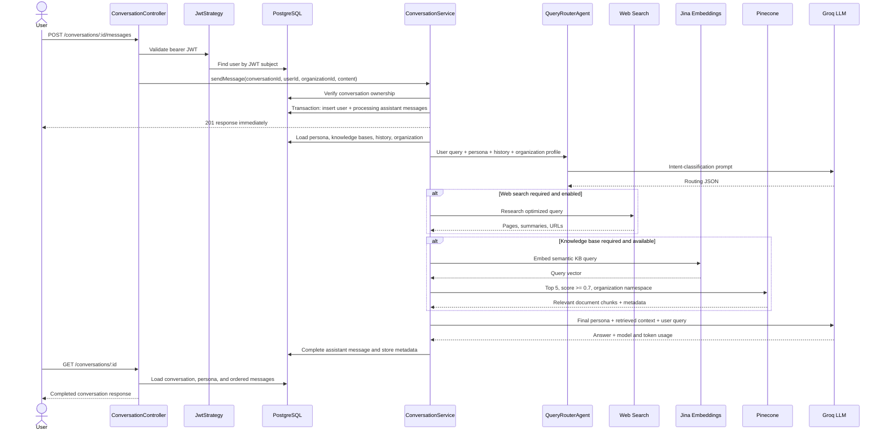
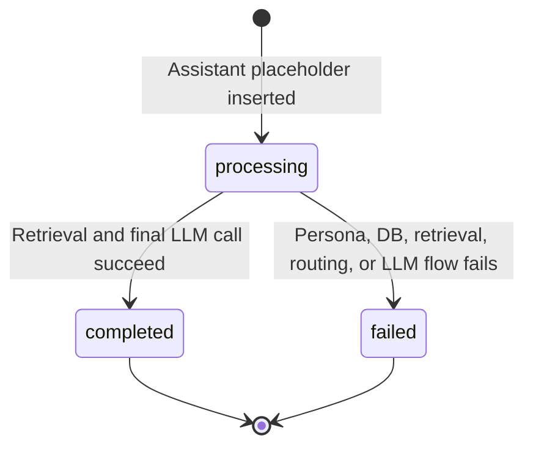

# Conversation Flow and LLM Data Pipeline

This document describes the conversation system implemented in this project. It explains what happens after a user sends a message, which data is read from PostgreSQL and Pinecone, what is sent to the LLM, what is persisted, and how the client receives the completed answer.

## 1. Main components

| Component | Responsibility |
| --- | --- |
| `ConversationController` | Exposes the conversation HTTP endpoints and requires JWT authentication. |
| `JwtStrategy` | Validates the bearer token and loads the current user from PostgreSQL. |
| `ConversationService` | Creates conversations/messages, loads context, starts background processing, and stores results. |
| `CompanyContextService` | Reads and formats the organization profile from PostgreSQL. |
| `QueryRouterAgent` | Uses an LLM to decide whether web search and/or vector search is required. |
| `ConversationOrchestratorAgent` | Coordinates routing, retrieval, prompt construction, and final answer generation. |
| `ConversationWebSearchService` | Generates search queries, finds sites, and scrapes relevant pages when web search is enabled. |
| `KnowledgeBaseService` | Converts the semantic query into an embedding and requests matching chunks from Pinecone. |
| `EmbeddingService` | Uses `jina-embeddings-v3` to generate 1,024-dimensional embeddings. |
| `PineconeService` | Stores and queries document vectors with organization and knowledge-base isolation. |
| `LlmService` | Selects a Groq model/API key, enforces the token budget, retries/fails over, and returns text plus token usage. |

## 2. High-level request flow



## 3. HTTP entry points

### Create a conversation

`POST /conversations`

Request body:

```json
{
  "persona_id": "UUID",
  "content": "The first user message"
}
```

The content is required and limited to 10,000 characters. The service verifies that the persona belongs to the authenticated user's organization. In one PostgreSQL transaction it then:

1. Creates an active conversation.
2. Generates a title from the first 80 characters of the normalized message.
3. Creates a completed `user` message.
4. Creates an empty `assistant` message with `processing` status.
5. Updates persona usage counters and `last_used_at`.

After committing, it starts `processMessage(...)` without awaiting it. The HTTP response therefore means that the message was accepted, not that the AI answer is ready.

### Add a message

`POST /conversations/:id/messages`

Request body:

```json
{
  "content": "A follow-up question"
}
```

The service first verifies that the conversation ID belongs to the current user and organization. A transaction inserts the user message and processing assistant placeholder, increments counters, and updates the conversation timestamp. AI processing again continues asynchronously.

### Read the answer

`GET /conversations/:id`

This endpoint reads the conversation only when all three values match:

- conversation ID;
- authenticated user ID;
- authenticated organization ID.

It includes the selected persona and every message ordered by `created_at`. The response also repairs common historical UTF-8 mojibake in message content. The frontend normally polls or refreshes this endpoint until the assistant message changes from `processing` to `completed` or `failed`.

## 4. Authentication and tenant isolation

All conversation endpoints use `JwtAuthGuard`.

1. The bearer JWT is decoded and verified.
2. `payload.sub` is used to fetch the user from PostgreSQL.
3. A transient database failure such as `ECONNRESET`, `ECONNREFUSED`, `ETIMEDOUT`, or `EPIPE` is retried once after 200 ms.
4. The user must exist, be active, and have a verified email.
5. The JWT must provide an organization ID for conversation endpoints.

Conversation queries include both `user_id` and `organization_id`. Pinecone queries use the organization ID as the namespace and also apply an `organization_id` metadata filter. When persona knowledge bases are selected, their IDs are added as a second filter.

## 5. PostgreSQL data read during processing

The background `processMessage(...)` operation reads the following data.

### Persona configuration

The persona is selected using its ID and organization ID. Its associated knowledge bases are also loaded. The following values become `personaConfig`:

| Field | How it is used |
| --- | --- |
| `name` | Included in the final system prompt. |
| `description` | Included in the final system prompt, truncated to 1,000 characters. |
| `primary_focus_role` | Defines the assistant's role. |
| `web_search_enabled` | Controls whether the router may select web retrieval. |
| associated knowledge-base IDs | Controls whether vector retrieval is available and limits Pinecone results. |

### Conversation history

Up to 20 messages are loaded in ascending creation order. The current user message and its processing assistant placeholder are excluded.

- The routing LLM receives only the last 3 historical messages, each shortened to approximately 150 characters.
- The final answer LLM receives only the last 4 historical messages, each limited to 600 characters.

This difference keeps routing cheap while still giving the answer model enough recent conversational context.

### Organization profile

`CompanyContextService` reads the organization by ID and formats these PostgreSQL fields:

- company name;
- description;
- industry;
- website;
- location;
- company size;
- product or service;
- target customers;
- business goals;
- current challenges;
- known competitors.

The formatted profile is trusted context. It is sent to both the routing LLM and final response LLM. The final prompt limits it to 3,500 characters.

## 6. First LLM call: intent routing

The `QueryRouterAgent` makes the first LLM call with task type `routing`, temperature `0.3`, and a maximum of 1,000 completion tokens.

### Routing system prompt data

The system prompt tells the model:

- whether web search is enabled for the persona;
- whether the persona has attached knowledge bases;
- when current/live information should use web search;
- when uploaded/internal information should use the knowledge base;
- that the organization profile is trusted database context;
- to return JSON only.

### Routing user prompt data

The user prompt contains:

1. The current user query.
2. The formatted organization profile.
3. Up to 3 recent conversation messages.
4. The required JSON response schema and examples.

Expected routing result:

```json
{
  "requiresWebSearch": true,
  "requiresKnowledgeBase": false,
  "searchQuery": "optimized web search query",
  "knowledgeBaseQuery": null,
  "queryType": "analytical",
  "confidence": 0.9,
  "reasoning": "Why these sources are required",
  "temporalIndicators": []
}
```

If JSON parsing fails, the router uses keyword-based fallback logic and a confidence of `0.5`.

## 7. Optional web retrieval

Web retrieval runs only when all of the following are true:

- the router sets `requiresWebSearch=true`;
- the persona permits web search;
- the web-search service is available.

The service generates several search queries from the user query, optimized router query, persona, organization context, and recent conversation. It then selects up to five primary sites and scrapes relevant pages.

The final prompt does not receive unlimited raw pages. The orchestrator:

- includes no more than two pages from one site;
- includes page title, page type, short summary, content excerpt, and source URL;
- limits each summary to 300 characters;
- limits each page content excerpt to 600 characters;
- limits total formatted web context to approximately 8,000 characters.

The database stores web-search metadata in `sources_used`, including queries, result count, site count, scraped-page count, failures, and a summary. It does not store every raw scraped page in the message record.

If retrieval fails, the answer model receives an explicit warning that current facts could not be verified.

## 8. Optional vector-database retrieval

Vector retrieval runs only when the router requests it and the persona has attached knowledge bases.

### How documents enter Pinecone

Before documents can be used in a conversation, the knowledge-base ingestion flow:

1. Downloads and extracts text from the uploaded file.
2. Cleans and validates the extracted text.
3. Stores up to 10,000 characters of extracted text and metadata in PostgreSQL.
4. Splits the complete cleaned text into chunks of 512 with an overlap of 50.
5. Sends chunks to Jina in batches of 32 using `jina-embeddings-v3`.
6. Stores each 1,024-dimensional vector in Pinecone.

Each Pinecone record contains metadata:

```text
organization_id, knowledge_base_id, file_id, chunk_index,
original_text, file_name, file_type, source_type, timestamp
```

### Query-time vector search

During a conversation:

1. The router's `knowledgeBaseQuery` is used; if absent, the original user query is used.
2. Jina converts that query into a vector.
3. Pinecone is queried in the organization's namespace.
4. Results are filtered by `organization_id` and the persona's knowledge-base IDs.
5. The orchestrator requests the top 5 matches with a minimum similarity score of `0.7`.
6. Metadata and original chunk text are returned.

Each result is formatted for the final LLM as:

```text
[Document 1] filename.pdf
Relevance Score: 87.2%
Content: <original matching chunk>
```

The complete formatted knowledge-base context is truncated to 3,500 characters before the final LLM call. The message's `sources_used` field records knowledge-base IDs, retrieved chunk count, and relevance scores.

## 9. Second LLM call: final answer generation

The final call uses task type `conversation`, temperature `0.7`, and requests up to 4,000 completion tokens.

### Final system prompt

The system prompt includes:

- persona name;
- persona role;
- persona description;
- whether web and knowledge-base capabilities are available;
- routed query type;
- which sources the router requested;
- rules to use only supplied evidence, cite web sources, reference internal documents, avoid fabricated information, and answer directly.

The shared LLM service also prepends a tool policy. The model is told that no tools are callable and that retrieval has already been completed. `tool_choice` is set to `none`.

### Final user prompt

The prompt is assembled in this order:

1. Up to 4 recent conversation messages.
2. Formatted web results, when available.
3. Formatted Pinecone document chunks, when available.
4. Formatted organization profile.
5. The current user query.
6. Final instructions to resolve words such as “our” and “we” using the organization profile and to cite supplied web links.

In simplified form:

```text
CONVERSATION HISTORY:
...

WEB SEARCH RESULTS:
...

KNOWLEDGE BASE CONTEXT:
...

ORGANIZATION PROFILE:
...

ANSWER REQUEST:
<current user query>
```

The request has a configurable Groq budget, currently defaulting to 7,200 total request tokens. Input tokens are estimated before the call. The completion allowance is reduced when necessary. If fewer than 256 tokens remain for an answer, the request is rejected as too large instead of sending an invalid request.

`LlmService` can try configured model/key combinations. It fails over for rejected keys, rate limits, unavailable models, empty output, or unexpected tool calls.

## 10. Data written after generation

On success, the assistant placeholder is updated with:

| Field | Stored value |
| --- | --- |
| `content` | Trimmed final answer with common mojibake repaired. |
| `status` | `completed` |
| `intent_analysis` | Complete routing result. |
| `sources_used` | Web and/or knowledge-base retrieval metadata. |
| `processing_time_ms` | End-to-end background processing duration. |
| `model_used` | Actual model returned by Groq. |
| `prompt_tokens` | Actual prompt token usage reported by Groq. |
| `completion_tokens` | Actual answer token usage reported by Groq. |
| `total_tokens` | Actual total token usage reported by Groq. |

On failure, the assistant placeholder is changed to `failed`, receives a safe retry message, and stores the underlying error text in `error_message`.

## 11. Conversation message states



The API can therefore return a mixture of completed, processing, and failed messages. HTTP `200 OK` from `GET /conversations/:id` only means the conversation was retrieved successfully; it does not imply that every assistant generation succeeded.

## 12. Important implementation behavior

- Conversation creation and message submission are asynchronous from AI generation.
- PostgreSQL is the source of truth for users, organizations, personas, conversation history, message status, and usage metadata.
- Pinecone contains semantic vectors and original document chunks; it is queried only when routing requests internal-document context.
- Web retrieval is separate from Pinecone and runs only when requested and permitted.
- Two LLM stages are used: one for routing and one for the final answer. Web query generation can make additional LLM calls inside the web-search service.
- The final LLM never receives database passwords, JWTs, API keys, user password fields, or complete user records.
- Organization and user filters prevent one tenant or user from loading another user's conversations.
- Vector search uses both an organization namespace and metadata filters for defense in depth.

## 13. Relevant source files

- `src/conversation/conversation.controller.ts`
- `src/conversation/conversation.service.ts`
- `src/conversation/conversation-web-search.service.ts`
- `src/agents/query-router/query-router.agent.ts`
- `src/agents/conversation-orchestrator/conversation-orchestrator.agent.ts`
- `src/company-context/company-context.service.ts`
- `src/knowledge-base/knowledge-base.service.ts`
- `src/knowledge-base/services/embedding.service.ts`
- `src/knowledge-base/services/pinecone.service.ts`
- `src/llm/llm.service.ts`
- `src/auth/strategies/jwt.strategy.ts`
